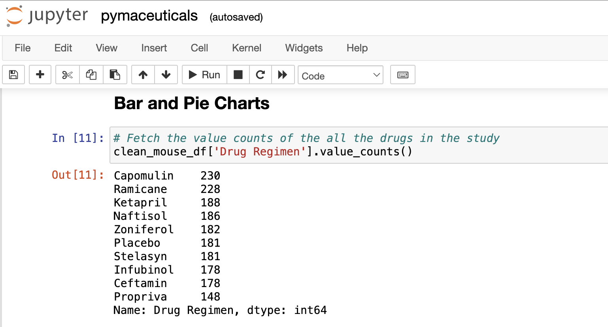
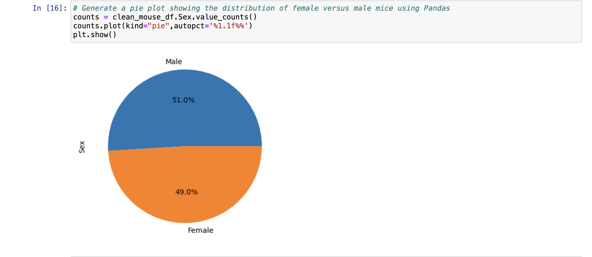
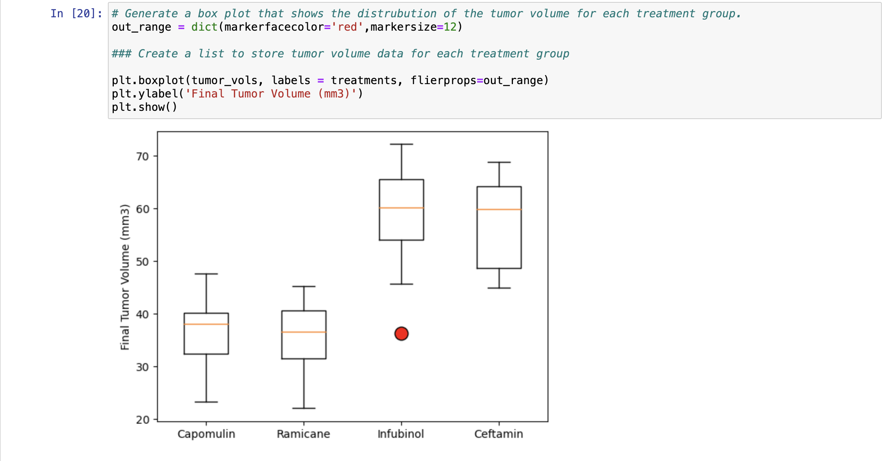
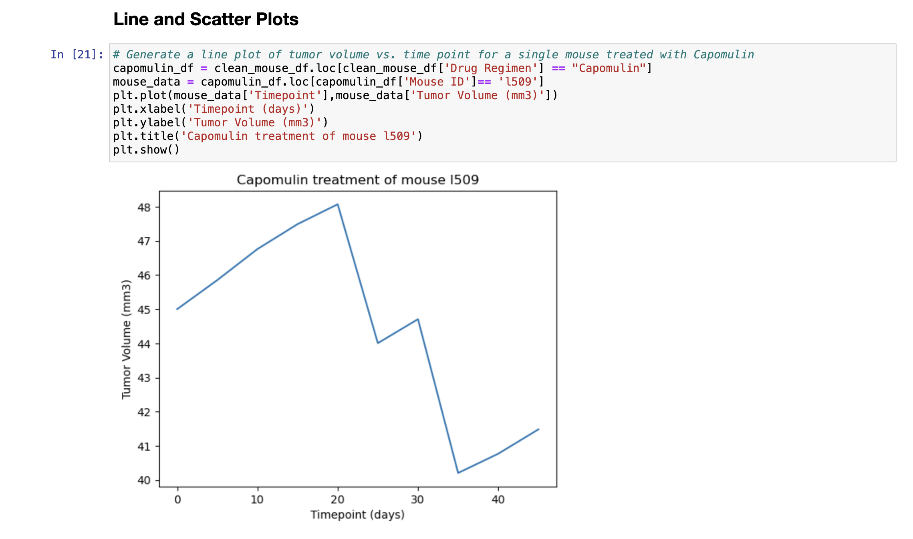
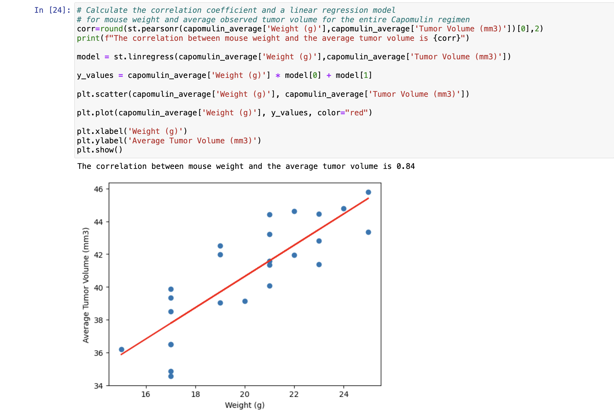

# Pymaceuticals_challenge

## Background
You've just joined Pymaceuticals, Inc., a new pharmaceutical company that specializes in anti-cancer medications. Recently, it began screening for potential treatments for squamous cell carcinoma (SCC), a commonly occurring form of skin cancer.

As a senior data analyst at the company, you've been given access to the complete data from their most recent animal study. In this study, 249 mice who were identified with SCC tumors received treatment with a range of drug regimens. Over the course of 45 days, tumor development was observed and measured. The purpose of this study was to compare the performance of Pymaceuticals’ drug of interest, Capomulin, against the other treatment regimens.

The executive team has tasked you with generating all of the tables and figures needed for the technical report of the clinical study. They have also asked you for a top-level summary of the study results.

## Instructions
This assignment is broken down into the following tasks:

1. Prepare the data.

2. Generate summary statistics.

3. Create bar charts and pie charts.

4. Calculate quartiles, find outliers, and create a box plot.

5. Create a line plot and a scatter plot.

6. Calculate correlation and regression.

7. Submit your final analysis.

# Analysis
* From the summary statistics and value counts of the drugs in the study show Capomulin and Ramicane each have 230 and 228 counts indicative that they are close competitiors.

* The male and female mice in the study are 958 and 922 respectively, indicating a distribution of 49% female mice and 51% male mice.
* Capomulin drug has been tested on 102 male and 128 female mice in the study.

* Out of the four most promising drugs only Infubinol has an outlier, Ceftamin has the highest tumor volume and the median of Infubinol and Ceftamin are visibly higher than Capomulin and Ramicane drugs.

* Line plot of Capomulin regimen indicates that tumor volume was highest on day 20 at 48 mm and lowest on day 35 at ~40.2 mm.

* The Scatter and Regression plots indicate that the lower the tumor volume, lesser the mice weight. The correlation between mouse weight and the average tumor volume is 0.84.

* The unique value_counts of the drugs in the study reveal that not all drugs have been administered the same number of times, hence it can't be definitively determined that one drug is better than the other.
* Further testing is required to determine the efficacy of the drugs in treating the tumor.

## How to Install and Run the script

To run this script:
1. Clone the git repo to your local git repository
2. Ensure *data and Images* directories and *pymaceuticals.ipynb* file are present
3. Ensure the respective csv datasets are present in the *data* folder
4. Run the script using **Jupyter Notebook** and view results
5. Be sure to run the entire script using *Restart & Run All option* from *Kernel* in *Jupyter Notebook* to get error free results
6. Or, you could alternatively run each block of code individually starting from the very top 
7. In additon, you could change the csv dataset containing the same columns in *data* folder and run the code to see the results

## Credits

To write this script, I used the starter code provided and discussed the various graph creations with my TAs.   

They helped me write a small portion of the logic to calculate some group by objects and scatter plots.  

Majority of the work went into understanding the various errors I encountered. I learnt a lot about graphs and visualizations using Matplotlib

## References

https://web.pdx.edu/~stipakb/download/PA551/boxplot.html#:~:text=In%20its%20simplest%20form%2C%20the,an%20end%20at%20each%20quartile.

https://www.nagwa.com/en/explainers/812192146073/#:~:text=Average%3A%20In%20a%20box%20plot,is%20no%20difference%20on%20average.

https://matplotlib.org/stable/gallery/statistics/boxplot_demo.html

https://medium.com/@marvelouskgc/three-ways-to-add-labels-to-each-data-point-in-a-scatter-plot-in-python-matplotlib-eugene-tsai-42e4094dc07e

